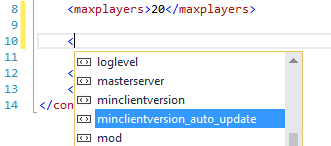
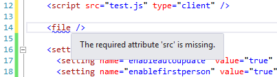

# gtan-xsd

XML Schema Definitions for GTA Network




## How to use

All you need to do is to include this snippet in the root element of your XML file:

```xml
xmlns:xsi="http://www.w3.org/2001/XMLSchema-instance"
xmlns="http://gtan-portal.com/schema/resource"
xsi:schemaLocation="http://gtan-portal.com/schema/resource 
                    http://gtan-portal.com/schema/resource/meta.xsd"
```

The paths have to be replaced according to the type of XML you want to create (e.g. for an ACL.xml you would
use the path "schema/resource/acl.xsd"). You can find a list of all the schemas to choose from below as well as a full example.

**Note for Visual Studio:** 
By default, Visual Studio disabled the automatic download of schema files. You can either
active it in the settings or you can manually download the files and replace the second url in xsi:schemaLocation with the local path
of the downloaded schema file.

### Example:

```xml
<?xml version="1.0" encoding="utf-8"?>
<config xmlns:xsi="http://www.w3.org/2001/XMLSchema-instance"
        xmlns="http://gtan-portal.com/schema/server"
        xsi:schemaLocation="http://gtan-portal.com/schema/server
                            http://gtan-portal.com/schema/server/settings.xsd">
  
    <servername>Example Testserver</servername>
    <maxplayers>20</maxplayers>
  
    <resource src="freeroam" />
    <resource src="speedometer" />
</config>
```

*Example of a settings.xml for a server*

## List of schemas

* [/schema/resource/acl.xsd](schema/resource/acl.xsd)
* [/schema/resource/meta.xsd](schema/resource/meta.xsd)
* [/schema/server/settings.xsd](schema/server/settings.xsd)

*Schema definitions can also be found in the directory [schema](schema/).*

## Credits

XML Elements are based on the [GTA Network Wiki](https://wiki.gtanet.work).

## License

This project is licensed under the MIT License - see the [LICENSE.md](LICENSE.md) file for details.